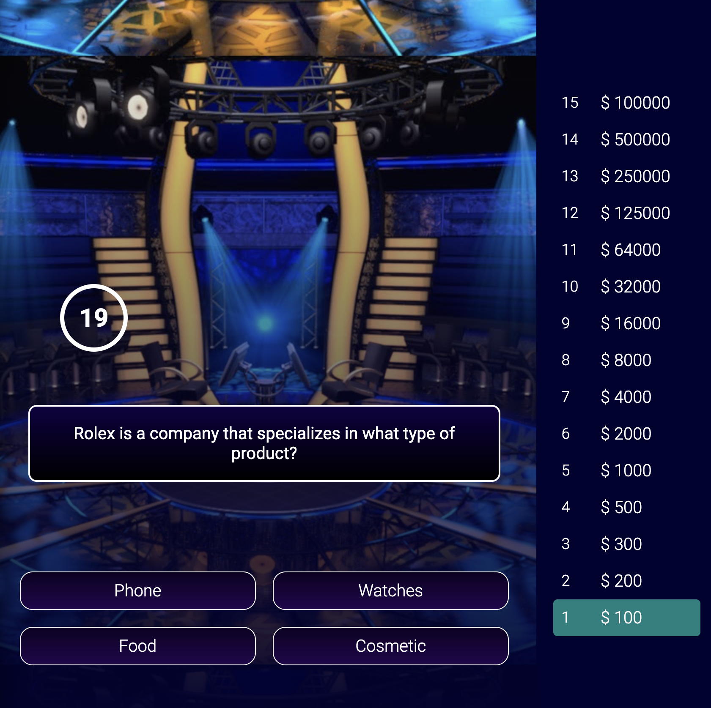
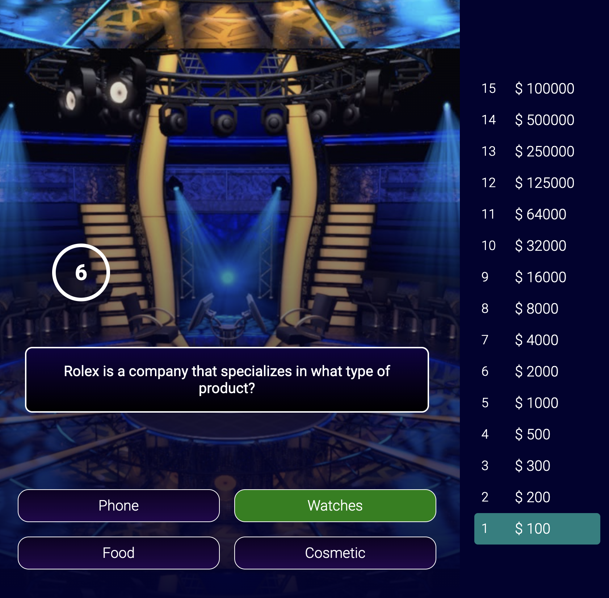
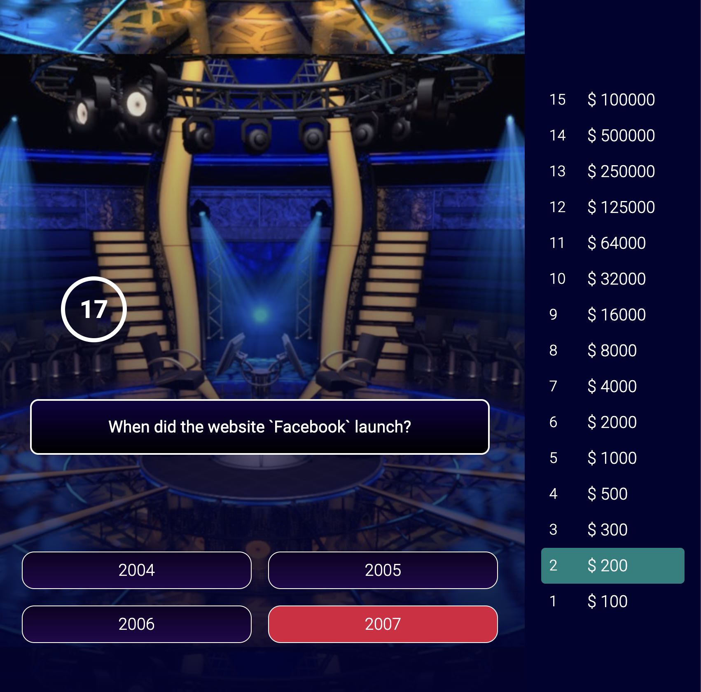

# MILLIONAIRE APP

The project, which is styled using CSS and utilizes React hooks such as useState, useEffect, useMemo, and the useSound React library, is a simulator of the "Who Wants to Be a Millionaire?" game.

[Click here](https://busratugul-millionaireapp.netlify.app/) for the application link.

